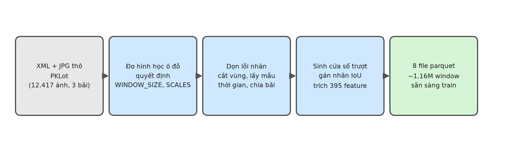

# Báo cáo kỹ thuật: Xử lý dữ liệu thô PKLot → tập feature huấn luyện



## 1. Bài toán xử lý dữ liệu

```
XML+JPG thô PKLot (12.416 ảnh, 3 bãi)
   ↓  đo hình học ô đỗ, quyết định tham số cửa sổ
   ↓  dọn lỗi nhãn, cắt vùng, lấy mẫu thời gian, chia bãi
   ↓  sinh cửa sổ trượt, gán nhãn, trích feature
   ↓
8 file parquet (1.180.200 window, 395 feature/window) → sẵn sàng huấn luyện model
```

## 2. Dữ liệu thô — đặc điểm và vấn đề phát hiện

Folder: https://drive.google.com/drive/u/0/folders/10pibZjDFxcx2igz37u2aRzZtFOFmLvoF

**Nguồn:** PKLot — 3 bãi (UFPR04, UFPR05, PUCPR), ảnh 1280×720, camera cố định, chụp 5 phút/lần
suốt nhiều tháng. Nhãn: 1 file XML/ảnh, mỗi ô đỗ có toạ độ contour + trạng thái `occupied`.

**6 vấn đề dữ liệu gốc phát hiện** (đều có sẵn trong archive UFPR gốc, không phải lỗi tải) — 4 vấn
đề đầu phát hiện khi parse toàn bộ 12.416 file XML, vấn đề thứ 5-6 phát hiện khi vẽ nhãn lên ảnh
thật / so khớp toạ độ giữa các ngày để kiểm tra bằng mắt (số liệu XML một mình không thấy được):

| Vấn đề | Phạm vi | Cách xử lý |
|---|---|---|
| Tag `<Point>` viết hoa thay vì `<point>` | 274/3791 file UFPR04 (7.2%) | Parser tìm cả hai dạng tag |
| Thiếu attribute `occupied` (trạng thái mơ hồ) | 778/12416 file toàn dataset (6.3%) | Giữ vị trí ô, đánh dấu "không rõ nhãn" — không bỏ, không đoán |
| Tên thư mục ngày sai — không khớp ngày thật trong tên file | 2 thư mục: `UFPR05/Sunny/2013-14-16/` (tháng không hợp lệ, thật ra là 2013-04-16), `PUCPR/Cloudy/2012-09-16/` (toàn bộ 145 file thật ra là 2012-10-16, không có thư mục 2012-10-16 nào khác) | Lấy ngày từ TÊN FILE, không lấy từ tên thư mục |
| Số ô trên mỗi bãi không đổi qua thời gian | UFPR04=28, UFPR05=40, PUCPR=100 ô/ảnh | Xác nhận qua toàn bộ file — không có ngoại lệ |
| PUCPR: xe thật đỗ ở rìa mỗi hàng nhưng không có nhãn nào (khác với "thiếu `occupied`" — ô này không tồn tại trong XML, không phải có nhưng thiếu 1 attribute) | 5 hàng, mỗi hàng có 1 vùng lề — xác nhận bằng cách vẽ nhãn lên ảnh thật (mục 4); UFPR04/UFPR05 đã kiểm chéo, KHÔNG dính vấn đề này | `unlabeled_margin_regions()` đánh dấu vùng lề mỗi hàng là "không rõ nhãn" — chi tiết ở mục 4 |
| **UFPR04: camera bị xê dịch vị trí 2 lần** trong quá trình ghi hình — KHÔNG phải camera cố định như README/KE_HOACH mô tả chung cho cả 3 bãi | 3 "kỳ" rời rạc: ~08/12-26/12/2012 (mốc), lệch ~55px từ 28-29/12, lệch ~94px từ 15/01/2013 trở đi. Đo bằng cách so khớp tâm ô giữa nhiều ngày cách xa nhau — UFPR05/PUCPR lệch đúng 0px suốt toàn bộ thời gian ghi hình (camera 2 bãi này THẬT SỰ cố định) | `annotated_region()` lấy hợp từ nhiều ảnh đại diện trải theo thời gian (không chỉ 1); `baselines.py` nhóm nhớ vị trí theo `(lot, kỳ camera, slot_id)` — chi tiết ở mục 4 |

Vấn đề thiếu `occupied` nặng nhất ở PUCPR:

- 396/4473 file dính lỗi, tổng 25.175 ô trên toàn bãi (trung bình ~64 ô/file dính, có file mất hơn
  nửa số ô) — so với UFPR04 (303 ô) và UFPR05 (295 ô).
- Đây là đặc điểm gốc của PUCPR, không phải do cách xử lý của dự án.

**Vì sao xử lý đúng các lỗi này quan trọng:**

- Bỏ qua lỗi `<Point>` → ~7% nhãn của 1 bãi train biến mất thầm lặng.
- Bỏ hẳn (thay vì giữ lại và đánh dấu) ô thiếu `occupied` → vị trí ô thật biến mất khỏi ground
  truth: model dự đoán đúng ngay vị trí đó bị chấm oan là sai (false positive), cửa sổ trượt trùng
  vị trí đó bị dạy nhầm là nền. Giải pháp: giữ vị trí, coi là **vùng bỏ qua** (ignore) xuyên suốt
  mọi khâu tính toán — không tính đúng cũng không tính sai ở đó.
- Tin theo tên thư mục cho ngày → ảnh của 1 ngày thật (VD 2012-10-16) bị trộn nhầm vào nhóm ngày
  khác (2012-09-16) lúc chia train/val theo ngày. Không đổi kết quả split hiện tại (2 thư mục sai
  đều thuộc UFPR05/PUCPR, không phải UFPR04 — bãi duy nhất dùng ngày để tách train/val), nhưng vẫn
  là lỗi tiềm ẩn cần sửa tận gốc để không vỡ nếu sau này đổi bãi dùng làm val.
- Bỏ qua vùng lề chưa gán nhãn ở PUCPR → xe thật ở vùng đó bị coi nhầm là nền (`background`) khi
  gán nhãn cửa sổ trượt. Vì PUCPR là bãi TEST, chỉ ảnh hưởng độ chính xác của điểm đánh giá cuối
  cùng (model đúng bị chấm oan false positive ở vùng đó — điểm test bị đánh giá THẤP hơn thực tế,
  không phải cao hơn). Chi tiết cách phát hiện và sửa ở mục 4.
- Bỏ qua việc camera UFPR04 bị xê dịch → 2 hệ quả xấu: (1) `annotated_region()` tính từ 1 ảnh đại
  diện có thể cắt cụt ô thật của ảnh thuộc kỳ khác (đã đo: 57/177 ảnh UFPR04 trong split, hỏng ~1
  ô/ảnh); (2) Baseline A "nhớ vị trí" theo `slot_id` mà không phân biệt kỳ sẽ áp nhầm vị trí kỳ này
  sang ảnh kỳ khác, cho điểm val sai lệch (đo được: điểm thật 0.518, số cũ trước khi sửa chỉ 0.153
  — sai gần 3.4 lần). Chi tiết ở mục 4.

## 3. Quyết định tham số hình học (`WINDOW_SIZE`, `SCALES`)

Đo trên **chỉ 2 bãi train+val** (UFPR04, UFPR05) — không đụng bãi test (PUCPR), để tránh làm lộ
thông tin của tập test vào quyết định thiết kế. Camera cố định nên hình học 1 ảnh đại diện thường
là đủ đại diện cho cả bãi — **ngoại lệ: UFPR04 có camera bị xê dịch 2 lần** (mục 2). Đã kiểm tra
riêng: kích thước ô (không phải vị trí) đo được ở cả 3 "kỳ" camera của UFPR04 chỉ dao động 86-97px
(rộng) — không đổi quyết định `WINDOW_SIZE=96` bên dưới (vẫn nằm trong cùng khoảng làm tròn 96),
nên không cần đo lại/tháo khóa quyết định Ngày 1 đã chốt.

| Đo | Cách tính | Kết quả | Quyết định |
|---|---|---|---|
| Kích thước ô trung vị (p50) | Với mỗi ô trong ảnh đại diện của bãi: lấy box axis-aligned (rộng, cao) từ 4 điểm `contour` trong XML. Gộp toàn bộ ô của UFPR04+UFPR05 (68 ô), lấy trung vị (p50) chiều rộng và chiều cao riêng | rộng 97px, cao 64.5px | `WINDOW_SIZE = 96` — làm tròn 97 xuống bội số 16, để mỗi cạnh cửa sổ chia hết cho ô HOG (16px/ô): 96/16=6 ô vuông, khớp đúng công thức 395 chiều (6×6×9=324 cho `hog_`). Nếu không chia hết (VD 97, 100px), `hog_` vẫn ra đúng 324 chiều (skimage tự làm tròn xuống số ô), nhưng ô cuối mỗi cạnh sẽ chịu ảnh hưởng lệch từ phần dư ngoài lưới ô — dùng bội số 16 để tránh sự lệch đó, không phải để tránh lỗi kích thước |
| Độ méo phối cảnh (`perspective_report()`) | Với mỗi ô: tính diện tích = rộng × cao. Trong CÙNG 1 bãi, lấy p90 (diện tích ô lớn thứ 90%, tức ô GẦN camera) chia cho p10 (diện tích ô nhỏ thứ 10%, tức ô XA camera) → tỉ lệ méo của bãi đó. Lấy giá trị TỆ NHẤT giữa UFPR04/UFPR05 | UFPR04: 13.803/3.996 = **3.45** · UFPR05: 12.150/3.649 = **3.33** → worst = 3.45 | 3.45 > ngưỡng 2.0 → `SCALES = [0.5, 0.75, 1.0, 1.5, 2.0]` (bắt buộc đa tỉ lệ) |

**Đối chiếu tham khảo với bãi test** (không dùng để quyết định, cùng công thức trên):

- Ô ở PUCPR nhỏ hơn ~2x (camera đặt xa hơn) so với UFPR04/UFPR05.
- Độ méo phối cảnh PUCPR: diện tích p90 = 3.762, p10 = 1.560 → **3.762/1.560 = 2.41**. Vẫn vượt
  ngưỡng 2.0, xác nhận quyết định `SCALES` trên đúng hướng ngay cả với bãi chưa từng "nhìn thấy"
  (dù độ méo PUCPR nhẹ hơn UFPR04/UFPR05, có thể vì phạm vi 100 ô của PUCPR trải rộng theo chiều
  ngang nhiều hơn theo chiều sâu/khoảng cách tới camera).
- Đây cũng là bằng chứng sớm cho hiện tượng domain shift sẽ gặp lại khi mở tập test thật.

## 4. Chống leakage: cắt vùng, lấy mẫu thời gian, chia theo bãi

**Cắt vùng có nhãn** — giải quyết đặc thù "PUCPR chỉ gán nhãn cho một phần bãi đỗ": tính vùng bao
quanh toàn bộ ô đã biết vị trí của mỗi bãi (có biên đệm), dùng vùng này làm hệ toạ độ chuẩn cho mọi
bước sau (nhãn, cửa sổ trượt, feature). → lưu vào **`crops.json`** (xem mục 6).

**Phát hiện thêm (kiểm bằng ảnh thật, không chỉ số liệu):** vẽ toàn bộ box đã gán nhãn lên ảnh gốc
cho thấy `crops.json` KHÔNG giải quyết triệt để vấn đề — bên trong vùng cắt của PUCPR, vẫn còn xe
đỗ thật hiện rõ ở rìa trái mỗi hàng mà không có nhãn nào (vì mỗi hàng chỉ gán ~20 ô, camera nghiêng
khiến mép trái thật của từng hàng khác nhau, 1 bbox chung không bao hết được). Đã kiểm chéo UFPR04/
UFPR05 bằng cách tương tự — 2 bãi đó gán nhãn đầy đủ, không dính vấn đề này.

- **Hệ quả nếu không sửa:** vì PUCPR là bãi TEST, chỉ ảnh hưởng đến độ chính xác của điểm đánh giá
  cuối cùng — model dự đoán đúng 1 xe thật ở vùng rìa này sẽ bị chấm oan là false positive (điểm
  test sẽ bị đánh giá THẤP hơn thực tế, không phải cao hơn — không có rủi ro "ăn gian").
- **Giải pháp:** `unlabeled_margin_regions()` — nhóm ô theo hàng, với mỗi hàng tính vùng từ mép trái
  `crops.json` tới ô có nhãn gần mép trái nhất, đánh dấu là vùng "không rõ nhãn" (dùng chung cơ chế
  `UNKNOWN_OCCUPIED` ở mục 2).
- **Chi tiết kỹ thuật cần sửa kèm theo:** vùng lề này lớn hơn hẳn 1 cửa sổ/prediction, nên phép so
  khớp IoU đối xứng cũ sẽ cho kết quả nhỏ giả tạo (đo thực tế: cửa sổ nằm TRỌN trong vùng lề chỉ có
  IoU ≈ 0.14, dưới hẳn ngưỡng 0.3) — phải đổi sang containment (diện tích giao / diện tích cửa sổ)
  cho việc kiểm tra vùng ignore, cả ở hàm tính AP lẫn hàm gán nhãn cửa sổ trượt.
- Đã verify trên ảnh thật: 401/407 cửa sổ nằm trong 1 vùng lề mẫu chuyển đúng thành `ignore` (6 cửa
  sổ còn lại ở sát biên vùng, containment chưa đủ ngưỡng — chấp nhận được).

**Lấy mẫu thời gian** — giải quyết đặc thù "ảnh gần trùng" (chụp 5 phút/lần): chỉ giữ 1 ảnh mỗi 2
giờ (`temporal_subsample()`, `TEMPORAL_MINUTES=120`), loại bỏ hàng loạt khung hình gần như giống
hệt nhau (cùng xe, cùng ánh sáng) trước khi đưa vào bất kỳ bước xử lý tốn kém nào. Cách ra số
**579**:

| Bãi | Ảnh gốc | Sau `temporal_subsample()` | Tỉ lệ giữ lại |
|---|---|---|---|
| UFPR04 | 3.791 | 177 | ~4.7% |
| UFPR05 | 4.152 | 192 | ~4.6% |
| PUCPR | 4.474 | 210 | ~4.7% |
| **Tổng** | **12.417** | **579** | ~4.7% |

**Thuật toán:**

- Sắp toàn bộ ảnh của 1 bãi theo đúng mốc thời gian ghi trong TÊN FILE (không phải tên thư mục —
  xem lỗi tên thư mục ở mục 2).
- Quét tuần tự theo thời gian: giữ 1 ảnh, bỏ qua mọi ảnh tiếp theo cách ảnh vừa giữ **dưới 120
  phút**, đến khi gặp ảnh đủ xa mới giữ tiếp.
- Kết quả phụ thuộc khung giờ ghi hình thực tế mỗi ngày (thường ~10-14 giờ ban ngày) nên KHÔNG cố
  định đúng 1 số/ngày — dao động 3–13 ảnh/ngày tuỳ độ dài ngày ghi hình hôm đó (VD: ngày ghi đủ 10
  giờ ra 5 ảnh, ngày chỉ ghi 4 giờ ra 3 ảnh).
- Bước này là ranh giới giữa 2 chỉ mục ở mục 6:
  - Đã qua lấy mẫu thời gian → **`splits.json`** (579 ảnh, split CHÍNH)
  - Bỏ qua bước này, giữ nguyên toàn bộ → **`splits_full.json`** (12.417 ảnh, chỉ mục tham khảo)

**Chia theo bãi, không theo ngẫu nhiên** — nguyên tắc cốt lõi chống leakage của toàn dự án. Vì camera
cố định và xe đỗ lại hàng giờ, một chương trình chỉ ghi nhớ vị trí ô (không nhìn ảnh) vẫn đạt điểm
cao nếu chia dữ liệu sai. Cách chia:

| Split | Nguồn | Số ảnh |
|---|---|---|
| train | UFPR04 (148/177 ngày) + toàn bộ UFPR05 (192) | 148 + 192 = **340** |
| val | UFPR04 (29/177 ngày còn lại, ~15%) | **29** |
| test | Toàn bộ PUCPR | **210** |
| **Tổng** | | **340 + 29 + 210 = 579** |

- 177 ảnh của UFPR04 (sau lấy mẫu thời gian) bị tách theo NGÀY — không theo ảnh — thành 2 phần
  không giao nhau: ~15% số NGÀY (làm tròn theo từng nhóm thời tiết, xem dưới) đưa vào val (ra 29
  ảnh), phần ngày còn lại đưa vào train (148 ảnh).
- UFPR05 và PUCPR không bị chia — 100% UFPR05 vào train, 100% PUCPR vào test, vì ranh giới chống
  leakage chính là RANH GIỚI BÃI (không phải ranh giới ngày) giữa 2 nhóm này.
- Kết quả chia (cột `split` trong bảng trên) được lưu thành danh sách file trong **`splits.json`**
  — file được coi là ĐÃ KHÓA (mục 6): mọi bước sau (dựng `gt.csv`, sinh feature) đều đọc từ đây,
  không random lại.

**Chia ngày cân bằng theo thời tiết:**

- Mỗi ngày chỉ có 1 nhãn thời tiết (Cloudy/Rainy/Sunny) — nếu chọn ngày cho val một cách "mù thời
  tiết", dễ dồn hết những ngày Rainy hiếm về 1 phía.
- Việc chia ngày cho val nay thực hiện RIÊNG trong từng nhóm thời tiết (đảm bảo mỗi loại thời tiết
  có ít nhất 1 ngày vào val), thay vì chọn ngẫu nhiên trên toàn bộ ngày.
- Do UFPR04 chỉ có 6 ngày Rainy, tỉ lệ ảnh Rainy giữa train/val vẫn còn lệch (~9.5% vs ~17.2%) —
  giới hạn cố hữu vì mẫu Rainy quá nhỏ, không thể khắc phục thêm nếu vẫn giữ nguyên tắc tách biệt
  theo ngày.
- Riêng tập test (toàn bộ PUCPR) có tỉ lệ Rainy cao hơn cả train (~16.7%) — đây là khác biệt thời
  tiết thật giữa 2 bãi, không thể "sửa" bằng cách chọn lại ảnh vì nguyên tắc là dùng 100% PUCPR
  cho test.

**Kiểm chứng split không rò rỉ vị trí** — Baseline A: một mô hình "ngây thơ" chỉ nhớ vị trí+nhãn đa
số của từng ô từ tập train, lặp lại y nguyên khi đánh giá, không nhìn ảnh thật:

| Đánh giá trên | Điểm (mAP) | Ý nghĩa |
|---|---|---|
| val (cùng bãi UFPR04, khác ngày) | 0.518 | leak thật sự đáng kể có chủ đích — cùng bãi, xe đỗ lại đúng chỗ hàng giờ nên nhớ vị trí khá hiệu quả; dùng tham khảo trong lúc chưa mở test |
| **test (PUCPR, khác bãi hoàn toàn)** | **0.000** | **đúng kỳ vọng — xác nhận split không rò rỉ vị trí** |

- Baseline A trên PUCPR ra đúng 0 vì bãi khác hoàn toàn về vị trí/số lượng ô — không có cách nào để
  "nhớ vị trí" từ train mà áp dụng được sang test. Đây chính là bằng chứng định lượng rằng cách
  chia dữ liệu của dự án là hợp lệ, đúng tinh thần nguyên tắc "chia theo bãi đỗ, khóa vĩnh viễn".
- Baseline A đọc trực tiếp từ **`gt.csv`** (mục 6) — box + nhãn mỗi ô, đã có sẵn cột `split` để lọc
  train/val/test.

**Phát hiện + sửa quan trọng (kiểm chứng đúng đắn của chính Baseline A):** đo lại độ lệch vị trí ô
giữa các ngày xa nhau trong UFPR04 phát hiện camera bị XÊ DỊCH VỊ TRÍ 2 LẦN trong quá trình ghi
hình — 3 "kỳ" camera rời rạc (lệch 0px trong cùng kỳ, nhưng ~55px và ~94px giữa các kỳ khác nhau).
UFPR05/PUCPR xê dịch đúng 0px suốt toàn bộ thời gian — camera THẬT SỰ cố định, không dính vấn đề
này. `_memorize()` bản đầu nhóm theo `(lot, slot_id)` không phân biệt kỳ — "nhớ" vị trí từ ảnh TRAIN
xếp trước nhất theo alphabetic (luôn rơi vào kỳ sớm nhất), rồi áp nhầm vị trí đó cho ảnh VAL thuộc
kỳ khác (~59% ảnh val không cùng kỳ với vị trí đã nhớ). Kết quả: điểm val 0.153 đo được trước đó
phần lớn phản ánh LỖI SAI VỊ TRÍ DO KHÁC KỲ CAMERA, không phải bản chất leak thật của việc "cùng
bãi, khác ngày". Đã sửa: nhóm theo `(lot, kỳ camera, slot_id)` — kỳ xác định bằng vị trí ô có
`slot_id` nhỏ nhất còn rõ nhãn trong CÙNG ảnh, ảnh thuộc kỳ TRAIN chưa từng thấy thì bỏ qua (thà
không đoán còn hơn đoán sai vị trí). Điểm val đúng sau khi sửa: **0.518** — cao hơn hẳn 0.153, khớp
đúng lý do vật lý ("xe đỗ lại hàng giờ" — README) hơn nhiều so với số cũ.

Phát hiện này còn hé lộ 1 bug khác đã sửa cùng lúc: **`annotated_region()`** (mục 4, "Cắt vùng có
nhãn") trước đó chỉ dùng 1 ảnh đại diện để tính vùng cắt — với UFPR04 có nhiều kỳ camera, vùng cắt
tính từ 1 kỳ có thể CẮT CỤT ô thật của ảnh thuộc kỳ khác (đã đo: 57/177 ảnh UFPR04 trong split, mỗi
ảnh cụt ~1 ô, tạo toạ độ âm khi trừ offset — hỏng dữ liệu ô đó). Đã sửa bằng cách lấy hợp (union)
vùng từ 10 ảnh đại diện trải đều theo thời gian, phủ đủ mọi kỳ — xác nhận còn 0/177 ảnh bị cắt cụt
sau khi sửa. **Toàn bộ `crops.json`/`gt.csv`/`gt_full.csv`/feature đã trích lại từ đầu sau 2 sửa này.**

## 5. Sinh cửa sổ trượt và trích feature

Folder: https://drive.google.com/drive/u/0/folders/1OP82DS-1Gk1510kLempfKfjZLikPIBMb

Trên ảnh đã cắt vùng, sinh cửa sổ trượt đa tỉ lệ theo `WINDOW_SIZE`/`SCALES` đã chốt. Mỗi cửa sổ
được gán 1 trong 4 trạng thái theo mức độ trùng khớp (IoU) với ô thật gần nhất trong ảnh:

- **`car`** / **`empty`** — trùng đủ để coi là 1 ô thật, nhãn lấy từ ô đó (có xe / trống)
- **`ignore`** — trùng mơ hồ (không đủ để chắc chắn là ô, cũng không đủ để chắc chắn là nền), HOẶC
  trùng đúng vị trí một ô có trạng thái "không rõ nhãn" (mục 2) — loại khỏi mọi tính toán
- **`background`** — không trùng ô nào — nền thật sự

- Giữ toàn bộ `car`/`empty`, lấy mẫu 10% số cửa sổ `background` (số lượng nền luôn áp đảo, không
  cần giữ hết), bỏ hoàn toàn `ignore`.
- Với mỗi cửa sổ giữ lại, trích 395 đặc trưng cổ điển (không dùng CNN): kết cấu ảnh (HOG), hoa văn
  cục bộ (LBP), phân bố màu, và kết cấu bề mặt (GLCM) — cùng nhóm tín hiệu README dự đoán sẽ quan
  trọng cho việc phân biệt ô có xe/trống (màu và kết cấu, không phải hình dạng, vì 2 lớp đều là
  hình chữ nhật giống nhau).

**Cắt ảnh "dựng thẳng" theo góc nghiêng thật của ô:**

- Mỗi ô đỗ trong nhãn gốc PKLot có một hình chữ nhật NGHIÊNG thật sự (tâm, kích thước, góc), nhưng
  box dùng để khớp cửa sổ trượt (IoU) là hình chữ nhật thẳng bao quanh nó — rộng hơn ô thật đáng kể
  ở góc nghiêng lớn (đo được: trung vị rộng hơn **1.58 lần diện tích** ở UFPR04, có ô rộng hơn tới
  **1.93 lần**, do camera đặt chéo).
- Nếu cắt feature thẳng theo box bao quanh này, ảnh đưa vào trích đặc trưng lẫn nhiều nền/ô bên
  cạnh hơn cần thiết.
- Đã xác minh góc nghiêng trong nhãn gốc khớp đúng chuẩn hình học chuẩn (dùng để tính toán xoay
  ảnh) với sai số ~5.7px/điểm (chỉ do nhiễu gán nhãn, không phải sai lệch hệ thống).
- Với mỗi cửa sổ khớp được 1 ô thật (`car`/`empty`), thay vì cắt theo box thẳng bao quanh, ảnh được
  XOAY quanh tâm ô theo đúng góc nghiêng thật rồi mới cắt đúng kích thước ô — loại bỏ hoàn toàn
  phần nền dư, chỉ giữ đúng vùng ô đỗ.
- Cửa sổ `background` (không khớp ô nào) vẫn cắt thẳng như cũ vì không có góc nào để tham chiếu.

## 6. File trong `processed/`

Folder: https://drive.google.com/drive/u/0/folders/1CYyZiQGhX28QNIobX_NhkbaYGYfZrrB6

| File | Ảnh phủ | Nội dung | Trong Git? |
|---|---|---|---|
| `splits.json` | 579 (sau `temporal_subsample`) | Danh sách file train/val/test — split CHÍNH, đã khóa vĩnh viễn, mọi `gt.csv`/feature dùng cho model đều dựa trên đây | Có |
| `splits_full.json` | 12.417 (toàn bộ ảnh gốc) | Cùng ranh giới ngày/bãi với `splits.json` nhưng KHÔNG qua lấy mẫu thời gian — chỉ mục tham khảo, dùng lại khi cần mở rộng dữ liệu train sau này | Có |
| `crops.json` | — (theo bãi, không theo ảnh) | Vùng `annotated_region()` mỗi bãi (bbox các ô + biên đệm) — hệ toạ độ chuẩn dùng để trừ offset cho mọi box khác | Có |
| `gt.csv` | 579 (ứng với `splits.json`) | 34.686 dòng: mỗi dòng 1 ô thật/1 ảnh (box đã trừ offset crop, nhãn, `rot_*`) HOẶC 1 vùng lề "không rõ nhãn" của PUCPR (`slot_id` âm, 1.050 dòng — mục 4) | Không (dữ liệu dẫn xuất) |
| `gt_full.csv` | 12.417 (ứng với `splits_full.json`) | Như `gt.csv` nhưng phủ toàn bộ ảnh gốc — 741.893 dòng, sinh trong vài chục giây (chỉ parse XML). `gt.csv` là tập con đúng nghĩa của file này (đã verify) | Không |

- `splits.json`/`splits_full.json`/`crops.json` nhỏ và cần thiết để TÁI LẬP kết quả nên được commit
  vào Git (ngoại lệ trong `.gitignore`).
- `gt.csv`/`gt_full.csv` sinh lại được từ 2 file trên + XML gốc trong vài giây đến vài chục giây
  nên không cần commit, tránh phình repo.

## 7. Kết quả cuối cùng

| Chỉ số | Giá trị | Nằm ở đâu | Giải thích |
|---|---|---|---|
| Ảnh đầu vào (sau lấy mẫu thời gian) | 579 (148 UFPR04 train + 29 UFPR04 val + 192 UFPR05 train + 210 PUCPR test) | `processed/splits.json` | Số ảnh còn lại sau `temporal_subsample()` — trước khi chia train/val/test |
| Ảnh dùng thật (train/val/test) | 340 / 29 / 210 | `processed/splits.json` | 579 ảnh trên chia theo bãi + ngày (mục 4) |
| Ô ground truth | 34.686 — 1.402 ô "không rõ nhãn" (1 ô lẻ) + 1.050 dòng vùng lề PUCPR (mục 4) | `processed/gt.csv` | Mỗi dòng = 1 ô đỗ thật, HOẶC 1 vùng ignore, trong 1 ảnh |
| Cửa sổ đã trích feature | 1.180.200 (8 shard: 148.278/148.739/148.757/146.416/146.004/148.027/147.344/146.635) | `features/shard_00_of_8.parquet` … `shard_07_of_8.parquet` | Mỗi dòng = 1 cửa sổ trượt đã qua lọc IoU + lấy mẫu nền, có sẵn 395 feature (float32) — số liệu sau lần trích lại cuối cùng (fix crop UFPR04 đa kỳ + fix vùng lề PUCPR — mục 4) |
| Dung lượng dữ liệu feature | 1,8 GB | `features/` (8 file, ~226-230 MB/file) | Input trực tiếp cho `train_model.py` |
| Thời gian trích (tuần tự, 1 máy) | ~32 phút 28 giây (1948,1s cộng dồn, mỗi shard 187-298s) | — | Tổng thời gian chạy `build_dataset.py` cho cả 8 shard, không song song |

- Toàn bộ pipeline đã qua cổng kiểm tra bắt buộc trước khi train (harness tính điểm đã tự kiểm
  chứng đúng trên cả dữ liệu giả lập lẫn dữ liệu thật, bao gồm ca kiểm tra riêng cho các ô "không
  rõ nhãn").
- Dữ liệu và tham số đã khóa, sẵn sàng cho bước huấn luyện model đầu tiên (Decision Tree).

## 8. Kiểm chứng harness & quy tắc test set

**Harness self-test** (`evaluate_pklot.self_test()`) — bắt buộc PASS trước khi ai train:

| Kịch bản | Kỳ vọng (mAP_macro) | Thực tế (mAP_macro) | Kỳ vọng (free_slots_MAE) | Thực tế (free_slots_MAE) |
|---|---|---|---|---|
| GT = pred (khớp tuyệt đối) | = 1.0 | 1.0 | = 0.0 | 0.0 |
| Pred rỗng | = 0.0 | 0.0 | > 0 | 3.0 |
| Pred đúng vị trí ô "không rõ nhãn" (1 ô lẻ) | không tính false positive, mAP vẫn = 1.0 | 1.0 | = 0.0 | 0.0 |
| Pred nằm trọn trong 1 vùng ignore LỚN (VD vùng lề PUCPR — mục 4) | không tính false positive, mAP vẫn = 1.0 | 1.0 | không quy định | 0.0 |

PASS trên cả dữ liệu giả lập lẫn `gt.csv` thật (579 ảnh, 34.686 dòng).

**Quy tắc "test set chỉ mở một lần khi đánh giá cuối":** Baseline A (mục 4) và bước trích feature
đã chạy trên `test` (PUCPR) trước khi có model thật — đã xác nhận KHÔNG tính là vi phạm, vì:

- Baseline A là phép kiểm tra tất định (không học/tinh chỉnh gì từ dữ liệu) — không thể "rò rỉ"
  thông tin theo nghĩa ảnh hưởng quyết định mô hình.
- Trích feature là biến đổi cố định — tham số (`WINDOW_SIZE`/`SCALES`) đã chốt từ train+val, không
  đụng đến nội dung test.
- Quy tắc áp dụng cho **đánh giá mô hình thật** trên test — việc đó chưa xảy ra, chỉ xảy ra đúng 1
  lần khi mở test thật sự.
